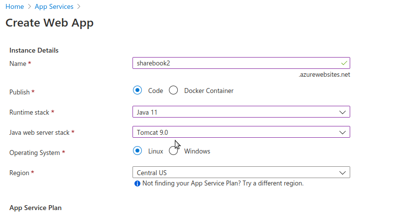
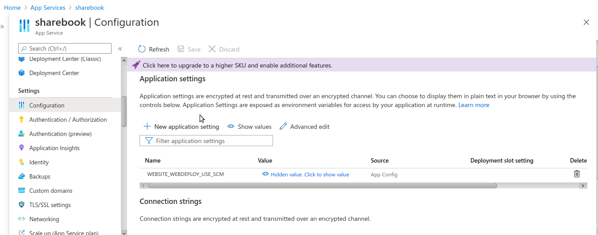

## Introduction

Le cloud prend de plus en plus de place pour le développement d'applications. Nous allons voir dans ce post comment déployer une application Spring Boot toute simple et bien connue, *PetClinic*, avec les GitHub actions!


## Déclaration de notre application dans Azure App Services

### Création de l'instance
Dans Azure, il faut tout d'abord créer une nouvelle instance d'application *App Services*.
Dans le menu *App Services* cliquez sur *Add*. Vous arrivez sur cet écran :



Il faut indiquer les informations suivantes :
- *ressource-group*: créez en un si non existant;
- *Name* : donner un nom à votre Application *App Services* (ne doit pas dejà exister)
- *Publish* : indiquer *code*. Pour l'instant on déploie directement du code et on laisse Azure gérer. On verra dans un autre post comment faire via une image Docker, et les avantages que cela apporte
- *Runtime Stack* : indiquer la version de JAVA. Nous c'est du *Java 11*
- *Stack* : Vérifier la version du Tomcat embarqué par l'appli Spring-Boot (via la version utilisée de Spring-Boot), mais si c'est la dernière version, ça sera certainement du Tomcat 9 (au moment de l'écriture du post);
- *OS* : Linux, je n'ai pas testé Windows;
- *Region* : le plus proche de chez vous :)

### Configuration requise pour Linux!
Tel qu'indiqué [ici](https://docs.microsoft.com/fr-fr/azure/app-service/deploy-github-actions?tabs=applevel), il est important si vous choisissez *Linux* dans l'étape précédente, d'ajouter une configuration spécifique  dans Azure.
Dans la nouvelle instance *App Services* que vous venez de créer, cliquez sur *Configuration*, vous arriverez sur cet écran :



 Cliquer sur  *New application Setting* puis indiquez :
 *WEBSITE_WEBDEPLOY_USE_SCM = true*

### Mise en place des Github Actions
Dans le repo Github que vous souhaitez déployer, il faut procéder à quelques manipulations. Il faut tout d'abord créer un secret pour connexion à Azure, puis mettre en place un workflow, contenant nos action Github pour compiler et déployer dans Azure.

### Création du secret
Dans Azure :
- Cliquez sur votre instance d'App Service créee à la première étape;
- Cliquez sur *Get Publish Profile*;
- Télécharger le fichier;

Dans Github :
- Cliquez sur votre repository, puis *Settings*
- Cliquez Sur *Secrets* puis *New reposirory Secret*
- Indiquez la clé *AZURE_WEBAPP_PUBLISH_PROFILE* avec en valeur le contenu du fichier de profile téléchargé ci-dessus;

### Mise en place des Actions Github
On souhaite automatiquement compiler et déployer notre application dans Azure via un _workflow_ Github.
Pour cela, il faut créer un fichier *yml*, à la racine du repository,  dans le répertoire (à respecter scrupuleusement, c'est comme ça que Github sait qu'il s'agit d'un workflow d'actions à exécuter!) : *.github/workflows/workflow.yml*

Dans ce fichier, on va déclarer nos actions afin de compiler et déployer dans Azure. Voici les différentes actions qu'on va utiliser :
- *actions/checkout@master* pour que le workflow accède au repository;
- *actions/setup-java@v1* pour mettre en place un environnement JAVA pour le workflow, afin de construire le JAR;
- *azure/webapps-deploy@v2* : les informations de connexion pour faire le déploiement vers Azure. Il faudra notamment indiquer :
  - le nom de l'instance *App Service* déclaré dans la première étape;
  - le *profile* déclaré dans la partie *Création du secret* ci-dessus;
  - *package* : indique le chemin vers le JAR.

On va également déclarer une partie _env_ pour y déclarer toutes nos propriétés utiles.

Voici le fichier au complet pour une appli Spring Boot Classique [Pet clinic](https://github.com/Azure-Samples/java-spring-petclinic).

```yml
name: Deploy Java app to Azure Web App

on: push

env:
  AZURE_WEBAPP_NAME: sharebook
  AZURE_WEBAPP_PACKAGE_PATH: ${{ github.workspace }}
  JAVA_VERSION: '1.11'
  AZURE_WEBAPP_PUBLISH_PROFILE: ${{ secrets.AZURE_WEBAPP_PUBLISH_PROFILE }}

jobs:
  build-and-deploy:
    name: Build and Deploy
    runs-on: ubuntu-latest
    steps:
    - uses: actions/checkout@master
    - name: Set up JDK 1.8
      uses: actions/setup-java@v1
      with:
        java-version: ${{ env.JAVA_VERSION }}
    - name: Build with Maven
      run: mvn package --file pom.xml
    - name: 'Deploy to Azure WebApp'
      uses: azure/webapps-deploy@v2
      with: 
        app-name: ${{ env.AZURE_WEBAPP_NAME }}
        publish-profile: ${{ env.AZURE_WEBAPP_PUBLISH_PROFILE }}
        package: '${{ env.AZURE_WEBAPP_PACKAGE_PATH }}/target/*.jar'
  ```

  L'ensemble du code source est acessible sur mon github ici : https://github.com/smaestri/sharebook