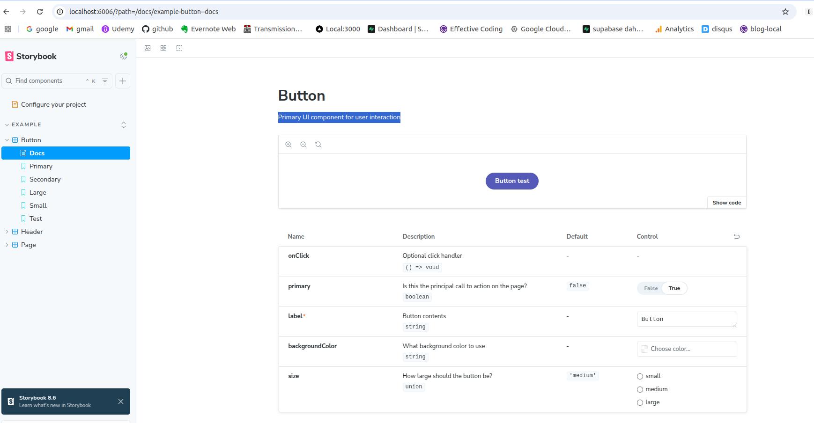
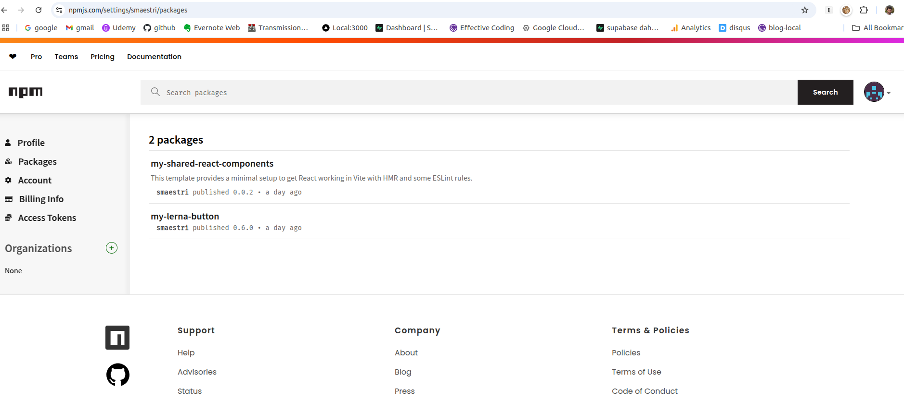

Nous allons décrouvrir la mise en place d'une bibliothèque de composants React, afin d'être réutilisables dans vos projets!
En effet, au fur et à mesure que votre ou vos applications grandissent, il peut être pertinent de centraliser les composants visuels dans une bibliothèque, pour éviter la duplication de code.

Nous allons voir dans une première partie comment faire cela avec les outils de base que sont NPM et VITE. Puis dans un second temps, nous verrons pourquoi l'utilisation d'un framework comme Lerna peut être pertinente, ce sera l'objet d'une deuxième partie [ici](http://effectivecoding.fr/2025-03-09-Bibliotheque-React-part2/)

## Création de la bibiliothèque
La bibiliothèque reposera sur le framework VITE, archi répandu pour faire des applications en React, et replaçant de Create React App, plus d'infos [ici](https://react.dev/blog/2025/02/14/sunsetting-create-react-app), ainsi que du framework [StoryBook](https://storybook.js.org/) pour exposer nos composants dans un UI sympa, et customizable.

### Créer l'application avec Vite
- créer l'application VITE, avec `npm create vite@latest` Indiquez `React` et `TypeScript` aux questions de l'installeur.
- builder l'application dans le répertoire où se trouve le ficheir `package.json` avec `npm install`
- Si vous le souhaitez, vous pouvez lancer l'application par défaut ainsi générée, via `npm run dev`
Nous appelerons ce projet le "projet bibilothèque" dans la suite de cet article.

### StoryBook

#### Introduction à StoryBook
StoryBook est un framework permettant de développer, tester des composants React (mais aussi sur de nombreux autres framework tel que Vue ou Angular). Il s'ajoute au dessus de VITE, et le remplace même dans certaines situations.

#### Mise en place de StoryBook
Pour installer StoryBook sur un projet VITE existant, simplement executez la commande suivante : `npx storybook@latest init`. L'installation prends quelques instants, et Storybook se lance automatiquement à la fin!  
De plus vous aurez droit à une présentation succinte de Storybook, et aussi créer votre première [story](https://storybook.js.org/docs/writing-stories/args)! Vous pouvez ainsi vous rendre compte comment StoryBook présente vos composants : tous les composants se trouvent sur le menu de gauche, avec pour chacun d'eux, une ou plusieurs "story" qui décrivent l'état particulier du composant. Par exemple, un bouton peut être de type "primaire" ou "secondaire", ce qui fera 2 stories.



Par ailleurs, l'installation de StoryBook va modifier votre fichier `package.json`, et ajouter les scripts suivants :
- `npm run storybook` pour lancer Storybook en local, et commencer le développement de vos composants React;
- `npm run storybook` pour lancer Storybook en local, et commencer le développement de vos composants React;
- `npm build storybook` pour builder le projet

Comme vous le constatez, nous n'allons plus utiliser `npm run dev` qui va lancer l'application Vite, mais `npm run storybook`, qui va lancer StoryBook en local. Cependant, Storybook utilise en arrière plan toutes les fonctionnaliés de VITE. Plus d'infos dans la doc [ici](https://storybook.js.org/docs/get-started/frameworks/react-vite).

### Notre premier composant
Par défaut, StoryBook crée un composant `Button` que vous pouvez voir si vous lancez l'application via `npm run storybook`.
Nous allons tout simplement essayer de builder et publier ce composant dans le registre NPM, afin d'être réutilisable dans un autre projet. 

Une  fonctionnalité intéressant de storybook via le plugin `autodoc` : nous  générons automatiquement la documentation à partir des commentaires Javascripts indiqués dans le fichier story (ici, `Button.stories.ts`)! Par exemple, sur le screenshot ci-dessus, la phrase "Primary UI component for user interaction" est directement issue du code javascript.
  
Voilà, pour la présentation de Storybook ! Maintenant il reste à publier ce composant `Button` dans un registre NPM pour le réutiliser. C'est ce que nous allons voir dans cette partie.

## Publicaton de la bibiliothèque - 1ère approche avec Vite, Rollup et NPM
Pour commencer, nous allons tenter de déployer notre composant `Button` uniqument via NPM et VITE. Bien entendu, nous souhaitons publier notre composant React uniquement (ici `Buttons.tsx`) et non les stories associées (`Button.stories.tsx`) qui sont uniquement voués à être utilisées pendant la phase de développement, ou pour exposer les composants sur un serveur via StoryBook.

On peut séparer le process de publication en deux phases : le build avec VITE, et le déploiement avec NPM.

### Configuration de Vite pour le build
Vite nous permet, grâce à son [mode "Librairie"](https://vite.dev/guide/build), de pouvoir exporter des composants afin de les réutiliser dans une autre application (en les installant avec `npm install <nom de la librairie>` dans l'application cible). Il est important de noter que ce process va transformer nos fichiers TYPESCRIPT et JAVASCRIPT pour être réutilisables pour une application qui n'utiliserait pas Javascript; de plus les fichiers seront minifiés. Enfin, ce n'est pas Vite directement qui effectue le build, mais Vite utilise [Rollup](https://rollupjs.org/configuration-options/) pour cela, une autre librairie sépocialisée dans le build JS.  

Ansi, il n'y aura pas de fichier HTML (par exemple le fameux `index.html `de Vite), on souhaite publier uniquement les composants React pour les réutiliser, pas une webapp complète avec les traditionnels fichiers HTML ou CSS;

Le build se configure avec VITE dans le fichier `vite.config.ts`, section `build` (vous pouvez aussi vous référer à la [documentation de VITE à ce sujet](https://vite.dev/config/)). Vous aurez également d'installer `@types/node` afin de pouvoir manipuler les fichiers (via la commande `npm install --save-dev @types/node `par exemple).

Voici à quoi ressemble notre fichier `vite.config.ts` :

```javascript
import { defineConfig } from 'vite'
import react from '@vitejs/plugin-react'
import {resolve} from "path"

export default defineConfig({
  build: {
    lib: {
      entry: resolve(__dirname, "./lib/index.tsx"),
      name: "my-components",
      fileName: (format) => `index.${format}.js`
    }, 
    rollupOptions: {
      external: ["react", "react-dom"],
      output: {
        globals: {
          react: "React",
          "react-dom": "ReactDom"
        }
      }
    }
  },
  plugins: [react()],
})
```

Explications :
- Il faut pensez à exporter le composant React que l'on souhaite publier : pour plus de simplicité, j'ai déclaré tous ces exports dans un seul et unique fichier ``lib/index.tsx`` qui aura le contenu suivant :

```javascript
import { Button } from "../src/stories/Button";
export {Button}
```

- Les propiétés `filename` et `name` indique le nom de fichier à exporter et le nom de la lib;
- il faut pensez à exclure React et React Dom du build; en effet, il est fort à parier que l'application "cible" (dans laquelle vous allez installez les composants React) utilise déjà React! Les lignes sous `rollupOptions` indiquent ceci.

Si on lance `npm run build`, on s'aperçoit que plusieurs fichiers sont générés dans un répertoire `dist`. Il s'agit de fichiers "transpilés" c'est à dire convertis en Javascript depuis Typescript, et optimisés pour les performances. Il s'agit de nos composants React, mais aussi toutes les dépendances nécessaires. Essayez de les ouvrir : vous verrez que leur contenu est rebutant! Néanmois, dans le fichier `index.es.js`, on voit nos composants React exportés. C'est tous ces fichiers qui constitueront notre bibiliothèque de nos composants React, à publier et à intégrer dans les applications qui en ont besoin. Mais comment ça se passe l'intégration? C'est ce qu'on va voir dans la prochaine partie.

## Intégration de la librairie dans un projet
Nous allons intégrer la librairie dans un projet afin d'utiliser les composants React qui s'y trouvent!

Pour ce faire, initialisons un nouveau projet avec Vite : `npm create vite@latest`, choisissez à nouveau React et Typescript, puis installez le projet avec ``npm install``. Nous l'appelerons ce projet  le projet "client" dans la suite de l'article, car c'est lui qui utilisera notre bibliothèqe de composants Rect partagés.

### Tester l'intégration en local
Plutot que de tester l'intégration directement depuis le reposiroty Nexus (nous le ferons plus tard, ne vous inquiétez pas), nous allons tester l'intégration en local. Pour cela, il existe une commande bien pratique, ``npm run pack``.

- Tout d'abord, à la racine du projet bibilothèque, on builde le projet comme vu précédemment via `npm run build`
- Ensuite, on exporte tous les fichiers transpilés dans un seul et même gros fichier ``.tar.gz``, via `npm  pack`
Notez que optionnellement, vous pouvez modifier la version de votre bibiiothèque via la commande `npm version <type>`, où `type` respecte la convention semver, soit `patch, minor ou major`. Et là, on tire un tout autre sujet sur la gestion des versions dans NPM qui est hors scope, mais je vous renvois à [cet article](https://www.younup.fr/blog/petit-rappel-du-semver-avec-npm) qui explique cela.

Ensuite, dans le projet client, nous allons installer nos composants React avec la commande `npm install <lien vers le fichier tar gz>`.

Dans le fichier racine `App.tsx`, nous allons importer le composant  React `Button`, via :  
`import {Button} from "my-react-components"`

et dans le `return` :
```javascript
return(
  <Button label="test" backgroundColor="green" />
)
```
### Petit soucis de type
Normalement à ce stade, vous aurez une erreur qui s'affiche `Could not find a declaration file for module <your-module> [...] Try npm i --save-dev @types/vite-project or add a new declaration (.d.ts) file containing declare module '<your module>'`

Pour corriger ce problème, faites comme le message l'indique et créer ce fichier ``.d.ts`` avec le contenu indiqué; il semble que Vite par défaut n'exporte pas les Types Typescript des composants React à exporter. Nous verrons dans la deuxième partie que Lerna corrige ce problème, et nous n'aurons plsu besoin de créer ces fichier ``.d.ts`` additionnels.

Une fois que vous avez créer ce fichier, vous n'aurez plus d'erreur. Lancez le projet client via `npm run dev ` et bingo, vous voyez votre magnifique bouton avec le texte "test" s'afficher sur fond vert.

### Publication dans le registre NPM
Nous avons réussi à 1/ crée notre bibliothèque et surtout 2/ l'utilisé dans un projet client en local, mais comment la publier dans le registre NPM, pour que tout le monde en bénéficie?

Si vous etes en entreprise, il est fort probable que vous avez un registre interne à votre entreprise, non public et donc non publié sur Internet. Dans ce cas de figure, il faut se référer à la [documentation NPM sur les organisations](https://docs.npmjs.com/organizations), et c'est payant. Par simplicité, nous allons dans cet article publier sur le repo public NPM, gratuit qui plus est. Voici la démarche :

- Créer un compte NPM sur le [site Internet npm](https://www.npmjs.com/)
- Se connecter au compte NPM depuis votre oridnateur via la commande `npm login`
- A la racine de votre projet, c'est à dire où est stocké le `package.json`, executez la commande `npm publish`

Vous pouvez allez voir sur le siet web NPM, vosu connectez et aller à la section "packages", normalement vous devriez voir votre package venant d'être publié!



Voilà, vous avez buildé et publié le composant react `Button` dans le registre NPM, bravo! On va pouvoir maintenant réutiliser cette librairie dans un projet, c'est ce qu'on va voir dans la partie suivante!

### Installation sur le projet client depuis le registre NPM
Retournez sur le projet client : nous allons à présent utiliser la vraie librairie publiée sur NPM, et pas le fichier .`tar.gz `crée en local :

- Supprimer la ligne qui référence votre `tar.gz` dans votre `package.json`
- Supprimez le répertoire `node_modules`
- Supprimez le fichier `package-lock.json`
- Lancer `npm install my-shared-react-components` (ou le nom que vous avez indiqué précédemment)
- Dans le fichier `App.tsx`, vous aurez une erreur car le bouton est toujours importé depuis le local.

Modifiez:
`import {Button} from "<votre fichier tar.gz local>"`  
en ``import {Button} from "my-shared-react-components"``

- Lancez ``npm run dev`` : bingo! Vous devriez voir votre bouton, cette fois importé depuis le registre NPM Internet!

 ### Deux soucis majeurs avec le process actuel
 Nous avons réussi précédemment à publier des composants React dans le registre NPM afin d'êtrez réutilisé dans des apps clientes, c'est déja un super but!
 Il y a cepdendant au moins deux gros problèmes :
 - nous avons du déclarer un fichier `module.d.ts` avec le process de build actuel via Vite / Rollup; c'est vraiment embêtant de devoir créer ces fichiers qui polluent notre base de code!
 - et aussi un autre gros inconvénient et que TOUS les composants React sont publiés dans LE MEME package (ici `my-shared-react-components`). Du coup, il n'est pas possible d'avoir un compisant en `V1`, et un autre composant en `V2`, car ils sont issus du même package "englobant", avec une version figée!


 Nous allons voir dans la partie suivante que Lerna permet de pallier à ces deux soucis.

